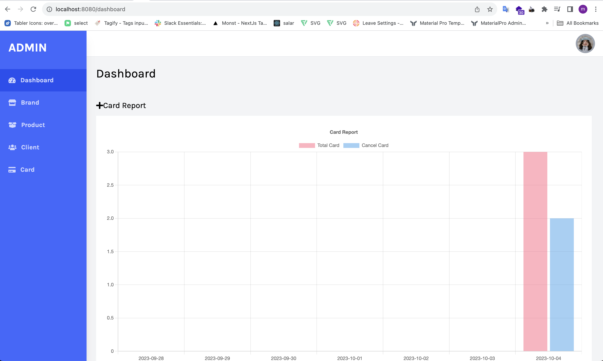

### Introduction
This application is designed to manage brands, products, and cards. It offers a versatile set of features for efficiently handling branding, product inventory, card issuance, and management processes.



### Prerequisites
Before you begin, make sure you have the following prerequisites installed on your system:
- Docker: [Install Docker](https://docs.docker.com/get-docker/)
- Docker Compose: [Install Docker Compose](https://docs.docker.com/compose/install/)
- Git: [Install Git](https://git-scm.com/book/en/v2/Getting-Started-Installing-Git)
- Ruby [3.1.2]: [Install Ruby](https://www.ruby-lang.org/en/documentation/installation/)
- Rails [7.0.8]: [Install Rails](https://guides.rubyonrails.org/getting_started.html#installing-rails)
- Postgresql [15]: [Install Postgresql](https://www.postgresql.org/download/)
- ReactJs [18.2.0]: [Install ReactJs](https://react.dev/learn/installation)

### Installation & Configuration

##### 1. Check out the repository

```bash
git clone git@github.com:tmanhkha/shop-app.git
cd shop-app
```

##### 2. Build and run the Docker containers

Build and run the Docker containers
```bash
docker-compose up --build
```

##### 3. Database Setup
```bash
docker-compose run backend rails db:create db:migrate db:seed
```

##### 4. Running the Application
Your application should now be running at [http://localhost:8080](http://localhost:8080). You can access it in your web browser.

### Testing
This project uses RSpec for testing. To run the tests, use the following command
```bash
docker-compose run backend rspec
```

### Usage
```bash
admin login url: 'http://localhost:8080/sign_in'
email: admin@example.com
password: 12345678
```
```bash
client login url: 'http://localhost:8080/client/sign_in'
```

### Troubleshooting
##### 1. Docker Permissions
- Issue: Permission issues when running Docker commands.
- Solution: Add your user to the docker group, or use sudo when running Docker commands (e.g., sudo docker-compose up).
##### 2. Port Conflicts
- Issue: Ports required by your containers are already in use.
- Solution: Change the port mapping in your docker-compose.yml file to an available port.
